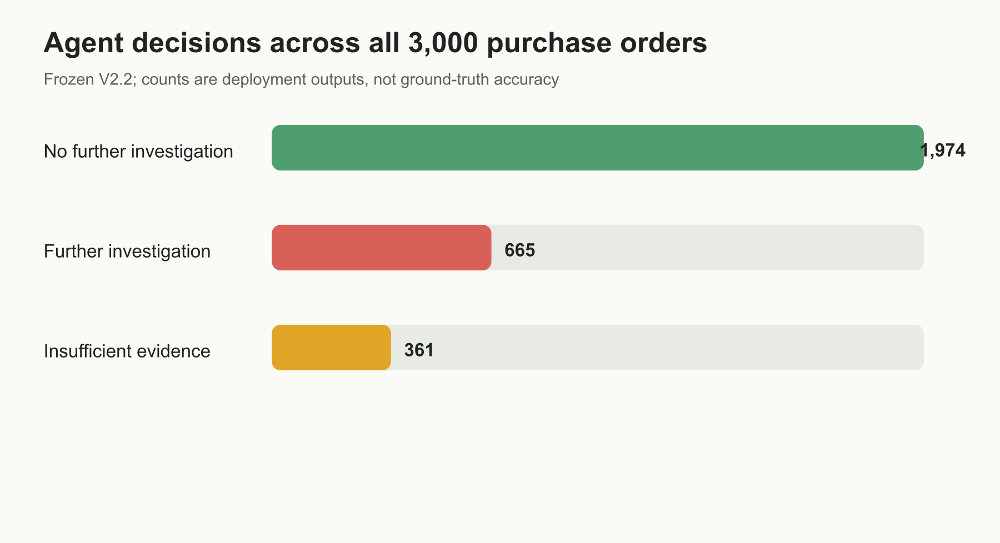
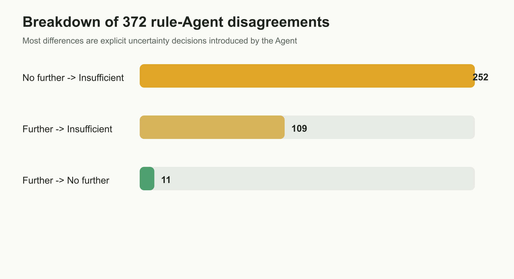

# P2P Compliance Investigation Agent — LLM vs. Rule Baseline

An LLM agent that reviews purchase-to-pay event logs and decides whether a purchase
order needs manual investigation, evaluated head-to-head against a no-AI rule baseline
on 3,000 real purchase orders.

**The headline result is negative, and that is the point of the project.** The agent did
not reduce investigation workload — it increased it by 31%. Most of what looked like the
agent's added value turned out to be a structural exemption that belongs in a one-line
rule. A relative-accuracy advantage reported in an earlier draft was traced to an
effective sample size of 1 and has been retracted.

- Dataset: [BPI Challenge 2019](https://data.4tu.nl/articles/dataset/BPI_Challenge_2019/12715853) — 1.6M events, 251,734 PO line items, a multinational coatings company
- Model: `gpt-5.4-mini`, `reasoning_effort=low`, frozen prompt + SHA256 fingerprint
- Scale: 3,000 POs (seed-42 random sample), 14.4M tokens, **$12.65 total / $0.004 per PO**, 0 failed requests
- Full write-up: [`docs/`](docs/) (report, v2.3 revised)

---

## What the systems do

Each purchase order gets one decision.

| Decision | Rule baseline | Agent |
|---|:--:|:--:|
| `further_investigation` — a concrete unresolved process gap | ✅ | ✅ |
| `no_further_investigation` — closed loop, or withdrawn and terminated | ✅ | ✅ |
| `insufficient_evidence` — log cannot determine final state | ❌ | ✅ |

The rule baseline is deterministic: required events, ordering, reversal handling, closure.
The agent receives the same raw event timeline plus the rule findings as *hints*, and is
instructed to check the events independently.

---

## Results on 3,000 POs

| System | Investigate | Insufficient evidence | No investigation |
|---|---:|---:|---:|
| Rule baseline | 785 (26.2%) | — | 2,215 (73.8%) |
| Agent | 665 (22.2%) | 361 (12.0%) | 1,974 (65.8%) |



Agreement: 87.6% (2,628 / 3,000). Where they disagree:

| Rule | Agent | POs |
|---|---|---:|
| Investigate | Insufficient evidence | 109 |
| Investigate | No investigation | **11** |
| No investigation | Insufficient evidence | 252 |



### Finding 1 — workload went up, not down

`insufficient_evidence` is not "ignore this." It means a human still has to look.

**Rule baseline queue: 785. Agent queue: 665 + 361 = 1,026. +31%.**

Only 11 POs (1.4% of the rule's flags) were actually downgraded. The project's original
premise — that an LLM would strip false positives out of a naive rule's output — is not
supported.

### Finding 2 — 70% of the agent's "added value" is one `if` statement

Of the 252 POs the rule cleared but the agent flagged as uncertain, **251 say the same
thing**: this is a consignment order, goods were received, and the log does not show
consignment withdrawal or settlement.

Consignment doesn't go through order-level invoicing at all. A missing invoice there is
expected, not anomalous. It should be exempted deterministically on `Item Category` —
which was identified during design but never implemented in the rule baseline. Those
cases were therefore passed through to the agent and counted as its contribution.

### Finding 3 — the original accuracy claim was invalid, and I retracted it

An earlier version of this report claimed a **+10.6 percentage point** relative accuracy
advantage over the rule baseline, from a frozen holdout set of 47 POs with 9 adjudicated
disagreements (agent 7 correct, rule 2). Re-checking the raw files:

| | As reported | After re-check |
|---|---|---|
| Disagreements | 9 | **7** (2 cases had identical decisions) |
| Case composition | not stated | **all 7 were consignment POs** |
| Label independence | treated as independent | **4 notes were word-for-word identical** |
| Effective sample size | 9 | **1** |

Worse, that exact pattern was written into the frozen system prompt — *"consignment line
received but settlement not observable → `insufficient_evidence`"*. The holdout measured
prompt compliance, not judgment. And because the ground truth for all 7 was
`insufficient_evidence`, a two-class rule baseline was structurally incapable of scoring
on them.

The claim is retracted in [`docs/`](docs/) §6. The distribution and agreement statistics
in §5 are unaffected.

---

## What I'd do next

1. **Implement the four structural exemptions in the rule baseline** (consignment,
   service entry sheet, deleted line items, 2-way match) and re-run. Until then any
   comparison systematically overstates the agent.
2. **Build a test set I label myself**, blind and stratified by the disagreement matrix,
   without model-drafted notes. The current 42 labels were GPT-drafted and reviewed by me
   — same model as the system under test, so they are not independent ground truth.
   Scripts and rubric are in [`evals/`](evals/).
3. **Redraw the division of labour**: rules own structural exemptions; the LLM only
   handles what rules cannot express — reversal chains, cross-line invoice postings,
   historical ordering anomalies (e.g. vendor invoice dated before PO creation).

Not on the list: more prompt tuning.

---

## Limitations

- No per-case ground truth on the full 3,000, so 87.6% is agreement, not accuracy.
- All 42 human labels were GPT-drafted then reviewed by me. At least one confirmed
  mislabel: two POs were marked unclosed on invoices posted within a month of the log's
  effective end (2019-01-31), ignoring right-censoring.
- The rule baseline lacks structural exemptions, so it is a weaker comparator than it
  should be.
- The `Cumulative net worth (EUR)` field repeats one PO-level total across every event
  (98.2% of line items have a single distinct value), so amount-level three-way matching
  cannot be evaluated on this dataset at all. Only the "required documents present and
  consistent" half of the official compliance definition is testable here.
- This measures process-investigation behaviour under a given log and rule definition —
  not audit findings or realised financial loss.

---

## Repo layout

```
src/                    rule engine, agent, batch runner, scoring
  check_rules_v2.py       deterministic rule baseline
  agent_baseline_frozen_v1.py   frozen prompt + output schema
  po_summary_v2.py        structured fact summary fed to the model
  run_all_3000_batch_v2_2.py    full-scale batch run
evals/                  labels, blind-labelling rubric + sampler, frozen manifest
outputs/                predictions, crosstabs, metrics, disagreement lists
data/processed/         purchase_orders.jsonl (derived from the XES log)
docs/                   final report + figures
```

## Reproducing

```bash
python -m venv .venv && .venv/Scripts/activate      # Windows
pip install -r requirements.txt
export OPENAI_API_KEY=...

python src/extract_pos.py                # XES -> data/processed/purchase_orders.jsonl
python src/check_rules_v2.py             # rule baseline -> outputs/rule_findings_v2.jsonl
python src/run_all_3000_batch_v2_2.py    # agent, Batch API (~$13)
python src/build_final_experiment_report_v2_2.py
```

The 3,000-PO sample is fixed by `sampled_document_ids_seed42.txt`. The frozen agent
fingerprint is verified before every batch; see `evals/frozen_agent_v2_2_manifest.json`.

The raw BPI Challenge 2019 log is not committed (504 MB). Download it from the link
above, or the GitHub mirror `mrsonuk/BPI_Challenge_2019`, and note that it is
**latin-1 encoded**, not UTF-8.
